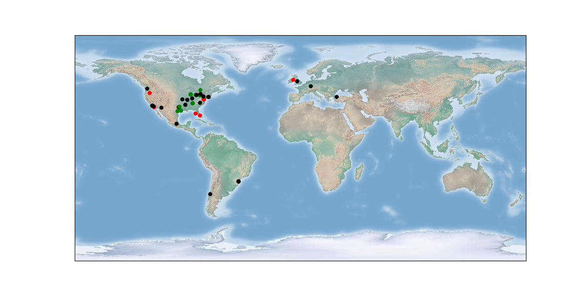

# TwitterStreams sentimental value live plotted on map
So in this project I have been doing som explorations in the tweepy library.
I have been trying to map the twitter feeds på location and got some pretty good results in my opinion.

## Install following packages
* Tweepy
* Numpy
* TextBlob
* Matplotlib

## This is the way you use it. 
* Get your own API key for the stream feed from [Twitter](https://www.twitter.com)
* Create a document.txt and copy the file-path to the path that i had
* Search for something you want to learn more about in form ['ex1','ex2','ex3'] you can search multiple things
* Wait for the plot to start doing its work. If you search for something less common don't expect many results
* To explain the dots the red are bad, green are good and all the black ones are not correct predicted from the Textblob library

## Restrictions in the twitter streaming api
There are a lot of restrictions for this streaming service and my setup for the project, ex:
* Twitter only gives you around 1-40% of the searches in the streaming api
* Above that you only get approximately 1-3% tweets that actually have coordinates in them.
* Program is heavy for the ram and cant compute fast enough for streaming service so i had to put a try block for it.

## Want to help out on the project? 
I have some things in mind that i wanna work on, but feel free to contribute if you like the idé.
* Get a better sentimental analysis, or make the existing work as it should.
* Get more of a color gradient so you can se more clearly how bad/good a tweet is.
* Animate the map a lot more nicer
* Overall designing of the code
